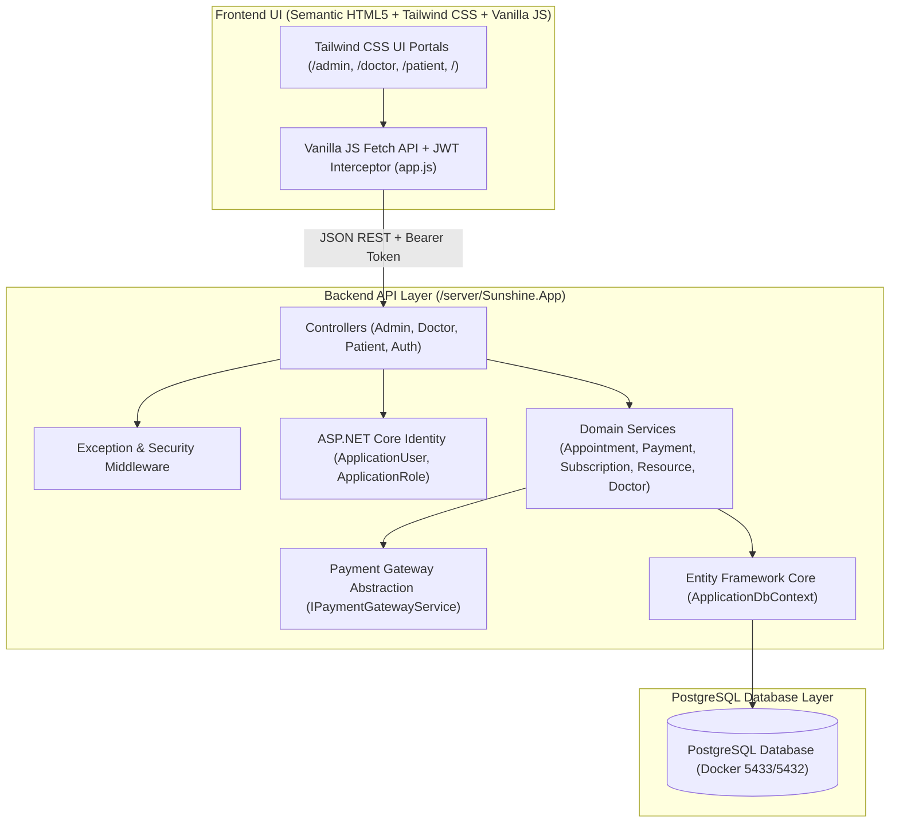

# Sunshine Mental Health Counseling System
## 04: Project Architecture & Security Tour

This guide details the security model, double-booking prevention architecture, payment policies, and server-side paywall enforcement.

---

## 1. High-Level Architecture Pattern



---

## 2. Double-Booking Prevention Architecture

Race conditions are eliminated at two separate layers:

1. **Serializable Database Transaction**:
   ```csharp
   await using var transaction = await _db.Database.BeginTransactionAsync(IsolationLevel.Serializable);
   ```
   Before saving a new appointment, `AppointmentService` checks for overlapping active appointments. If another thread is writing to the same slot, the transaction is isolated and safely rolled back.

2. **PostgreSQL Partial Unique Index**:
   ```sql
   CREATE UNIQUE INDEX "IX_appointments_DoctorId_AppointmentDate_StartTime"
   ON appointments ("DoctorId", "AppointmentDate", "StartTime")
   WHERE "Status" != 'CANCELLED';
   ```
   This ensures that even if concurrent requests bypassed the application layer, the database engine will reject duplicate active bookings.

---

## 3. Payment Policy & 15-Minute Window

1. **`ADVANCE` Policy**:
   - Appointment is initialized with status `PENDING`.
   - `BookingExpiresAt` is stamped at `DateTime.UtcNow.AddMinutes(15)`.
   - If the patient does not complete payment within 15 minutes, the slot is automatically cancelled and released when slots are queried.
   - Upon successful payment authorization, status transitions to `CONFIRMED` and `BookingExpiresAt` is cleared.

2. **`POST_PAYMENT` Policy**:
   - Appointment is confirmed immediately upon booking (`Status = 'CONFIRMED'`).
   - Payment is recorded after the consultation is completed.

---

## 4. Server-Side Paywall Enforcement

In `ResourceService.cs`, content URLs for premium literature are never transmitted to unauthorized clients:

```csharp
var userHasAccess = !r.IsPremium || hasActiveSub;
return new ResourceDto(
    ...
    ContentUrl: userHasAccess ? r.ContentUrl : null, // Masked server-side!
    HasAccess: userHasAccess
);
```
Even if a user inspects browser network payloads, premium PDF/Audio download URLs remain hidden until verified against an active record in `Subscriptions` where `CURRENT_DATE BETWEEN StartDate AND EndDate`.

---

## 5. Dedicated Admin Isolation

- Admin authentication is served by an isolated route `/api/admin/login`.
- Non-admin credentials attempting to log in via `/api/admin/login` receive a `403 Forbidden` response.
- All admin endpoints are protected by `[Authorize(Roles = AppRoles.Admin)]`.
