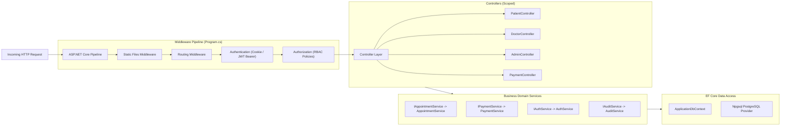

# Backend Layered Architecture Diagram

## Purpose
Visualizes the internal component structure and dependency injection lifecycle of `server/Sunshine.App`.

## Diagram

## Explanation
* **Scoped Lifetimes**: All controllers, domain services, and `ApplicationDbContext` instances are instantiated once per HTTP request and cleanly disposed at the end of the request cycle.
