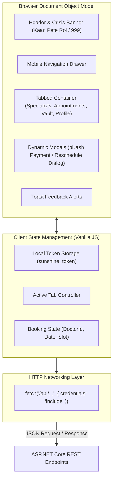

# Frontend Architecture Diagram

## Purpose
Illustrates how the vanilla HTML5/CSS3/JavaScript frontends interact with backend APIs without external frameworks.

## Diagram

```mermaid
flowchart TD
    subgraph DOM ["Browser Document Object Model"]
        Header["Header & Crisis Banner (Kaan Pete Roi / 999)"]
        Drawer["Mobile Navigation Drawer"]
        Tabs["Tabbed Container (Specialists, Appointments, Vault, Profile)"]
        Modals["Dynamic Modals (bKash Payment / Reschedule Dialog)"]
        Toasts["Toast Feedback Alerts"]
    end
    
    subgraph State ["Client State Management (Vanilla JS)"]
        TokenStore["Local Token Storage (sunshine_token)"]
        ActiveTab["Active Tab Controller"]
        Cart["Booking State (DoctorId, Date, Slot)"]
    end
    
    subgraph Network ["HTTP Networking Layer"]
        FetchAPI["fetch('/api/...', { credentials: 'include' })"]
    end
    
    DOM <--> State
    State --> Network
    Network -->|JSON Request / Response| BackendAPI["ASP.NET Core REST Endpoints"]
```
