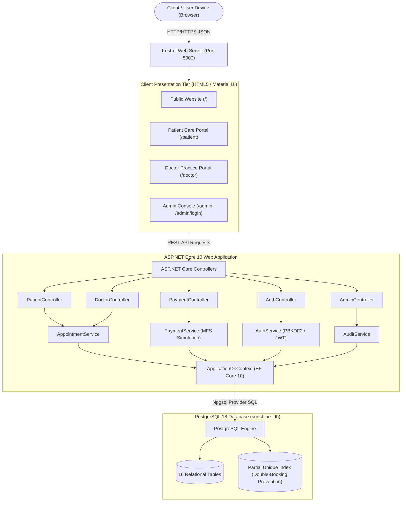

# Overall System Architecture Diagram

## Purpose
Visualizes the end-to-end multi-tier architecture of the Sunshine Mental Health Portal from the user's browser down to PostgreSQL storage.

## Diagram

## Explanation
1. **Client Tier**: Web browsers render responsive Material UI portals (Landing, Patient, Doctor, Admin) using pure HTML5, CSS3, and JavaScript.
2. **Kestrel Server**: ASP.NET Core's internal high-performance web server listens on port 5000 and terminates HTTP requests.
3. **Controller Tier**: Parses JSON payloads, validates Bangladesh mobile regexes, and checks role permissions.
4. **Service Tier**: Implements business rules (e.g. 15-minute advance booking hold, 45-minute BST slot calculation, and serializable transactions).
5. **Persistence Tier**: Entity Framework Core translates LINQ operations into SQL queries executed on PostgreSQL 18.
