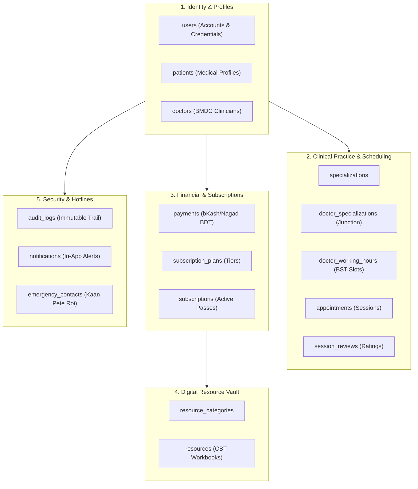

# Database Schema Overview Map

## Purpose
Visualizes the functional clustering of the 16 relational tables in PostgreSQL.

## Diagram

```mermaid
flowchart TD
    subgraph IdentityCluster ["1. Identity & Profiles"]
        users["users (Accounts & Credentials)"]
        patients["patients (Medical Profiles)"]
        doctors["doctors (BMDC Clinicians)"]
    end
    
    subgraph ClinicalCluster ["2. Clinical Practice & Scheduling"]
        specializations["specializations"]
        doc_spec["doctor_specializations (Junction)"]
        working_hours["doctor_working_hours (BST Slots)"]
        appointments["appointments (Sessions)"]
        reviews["session_reviews (Ratings)"]
    end
    
    subgraph FinancialCluster ["3. Financial & Subscriptions"]
        payments["payments (bKash/Nagad BDT)"]
        sub_plans["subscription_plans (Tiers)"]
        subscriptions["subscriptions (Active Passes)"]
    end
    
    subgraph KnowledgeCluster ["4. Digital Resource Vault"]
        res_cat["resource_categories"]
        resources["resources (CBT Workbooks)"]
    end
    
    subgraph SecurityCluster ["5. Security & Hotlines"]
        audit["audit_logs (Immutable Trail)"]
        notif["notifications (In-App Alerts)"]
        emergency["emergency_contacts (Kaan Pete Roi)"]
    end
    
    IdentityCluster --> ClinicalCluster
    IdentityCluster --> FinancialCluster
    IdentityCluster --> SecurityCluster
    FinancialCluster --> KnowledgeCluster
```
