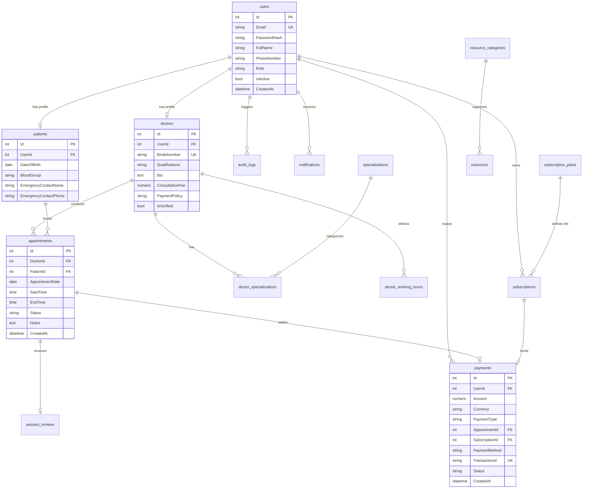

# Complete Database Entity-Relationship Diagram (ERD)

## Purpose
Complete Entity-Relationship Diagram (ERD) matching the 16 tables in `sql/03_schema.sql` and `Entities.cs`.

## Diagram

```mermaid
erDiagram
    users ||--o| patients : "has profile"
    users ||--o| doctors : "has profile"
    users ||--o{ payments : "makes"
    users ||--o{ subscriptions : "owns"
    users ||--o{ audit_logs : "triggers"
    users ||--o{ notifications : "receives"
    
    doctors ||--o{ doctor_specializations : "has"
    specializations ||--o{ doctor_specializations : "categorizes"
    doctors ||--o{ doctor_working_hours : "defines"
    doctors ||--o{ appointments : "conducts"
    
    patients ||--o{ appointments : "books"
    appointments ||--o| session_reviews : "receives"
    appointments ||--o| payments : "settles"
    
    subscription_plans ||--o{ subscriptions : "defines tier"
    subscriptions ||--o| payments : "funds"
    
    resource_categories ||--o{ resources : "organizes"
    
    users {
        int Id PK
        string Email UK
        string PasswordHash
        string FullName
        string PhoneNumber
        string Role
        bool IsActive
        datetime CreatedAt
    }
    
    doctors {
        int Id PK
        int UserId FK
        string BmdcNumber UK
        string Qualifications
        text Bio
        numeric ConsultationFee
        string PaymentPolicy
        bool IsVerified
    }
    
    patients {
        int Id PK
        int UserId FK
        date DateOfBirth
        string BloodGroup
        string EmergencyContactName
        string EmergencyContactPhone
    }
    
    appointments {
        int Id PK
        int DoctorId FK
        int PatientId FK
        date AppointmentDate
        time StartTime
        time EndTime
        string Status
        text Notes
        datetime CreatedAt
    }
    
    payments {
        int Id PK
        int UserId FK
        numeric Amount
        string Currency
        string PaymentType
        int AppointmentId FK
        int SubscriptionId FK
        string PaymentMethod
        string TransactionId UK
        string Status
        datetime CreatedAt
    }
```
