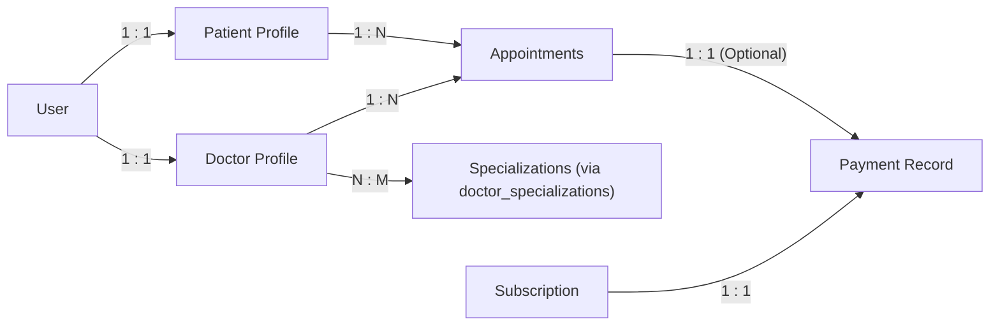

# Relational Integrity & Multiplicity Guide

## Purpose
Details entity multiplicities and cascading rules across the system.

## Cardinality Matrix

```mermaid
flowchart LR
    U["User"] -- "1 : 1" --> P["Patient Profile"]
    U -- "1 : 1" --> D["Doctor Profile"]
    D -- "1 : N" --> A["Appointments"]
    P -- "1 : N" --> A
    D -- "N : M" --> S["Specializations (via doctor_specializations)"]
    A -- "1 : 1 (Optional)" --> Pay["Payment Record"]
    Sub["Subscription"] -- "1 : 1" --> Pay
```
