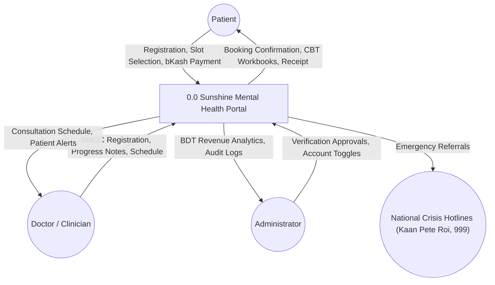

# Data Flow Diagram (DFD) Level 0 — Context Diagram

## Purpose
High-level context diagram representing the entire Sunshine system as a single process with external entities.

## Diagram

```mermaid
flowchart TD
    Patient(("Patient"))
    Doctor(("Doctor / Clinician"))
    Admin(("Administrator"))
    CrisisHotline(("National Crisis Hotlines (Kaan Pete Roi, 999)"))
    
    System["0.0 Sunshine Mental Health Portal"]
    
    Patient -->|Registration, Slot Selection, bKash Payment| System
    System -->|Booking Confirmation, CBT Workbooks, Receipt| Patient
    
    Doctor -->|BMDC Registration, Progress Notes, Schedule| System
    System -->|Consultation Schedule, Patient Alerts| Doctor
    
    Admin -->|Verification Approvals, Account Toggles| System
    System -->|BDT Revenue Analytics, Audit Logs| Admin
    
    System -->|Emergency Referrals| CrisisHotline
```
