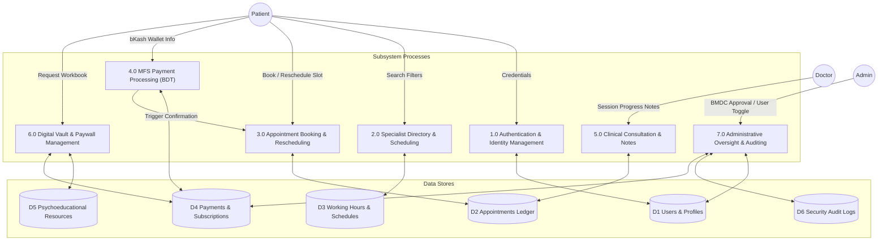

# Data Flow Diagram (DFD) Level 1 — Subsystem Processes

## Purpose
Decomposes the system into 7 core functional processes and 6 data stores.

## Diagram

```mermaid
flowchart TD
    Patient(("Patient"))
    Doctor(("Doctor"))
    Admin(("Admin"))
    
    subgraph Processes ["Subsystem Processes"]
        P1["1.0 Authentication & Identity Management"]
        P2["2.0 Specialist Directory & Scheduling"]
        P3["3.0 Appointment Booking & Rescheduling"]
        P4["4.0 MFS Payment Processing (BDT)"]
        P5["5.0 Clinical Consultation & Notes"]
        P6["6.0 Digital Vault & Paywall Management"]
        P7["7.0 Administrative Oversight & Auditing"]
    end
    
    subgraph DataStores ["Data Stores"]
        D1[("D1 Users & Profiles")]
        D2[("D2 Appointments Ledger")]
        D3[("D3 Working Hours & Schedules")]
        D4[("D4 Payments & Subscriptions")]
        D5[("D5 Psychoeducational Resources")]
        D6[("D6 Security Audit Logs")]
    end
    
    Patient -->|Credentials| P1
    P1 <--> D1
    
    Patient -->|Search Filters| P2
    P2 <--> D3
    
    Patient -->|Book / Reschedule Slot| P3
    P3 <--> D2
    
    Patient -->|bKash Wallet Info| P4
    P4 <--> D4
    P4 -->|Trigger Confirmation| P3
    
    Doctor -->|Session Progress Notes| P5
    P5 <--> D2
    
    Patient -->|Request Workbook| P6
    P6 <--> D5
    P6 <--> D4
    
    Admin -->|BMDC Approval / User Toggle| P7
    P7 <--> D1
    P7 <--> D6
    P7 <--> D4
```
