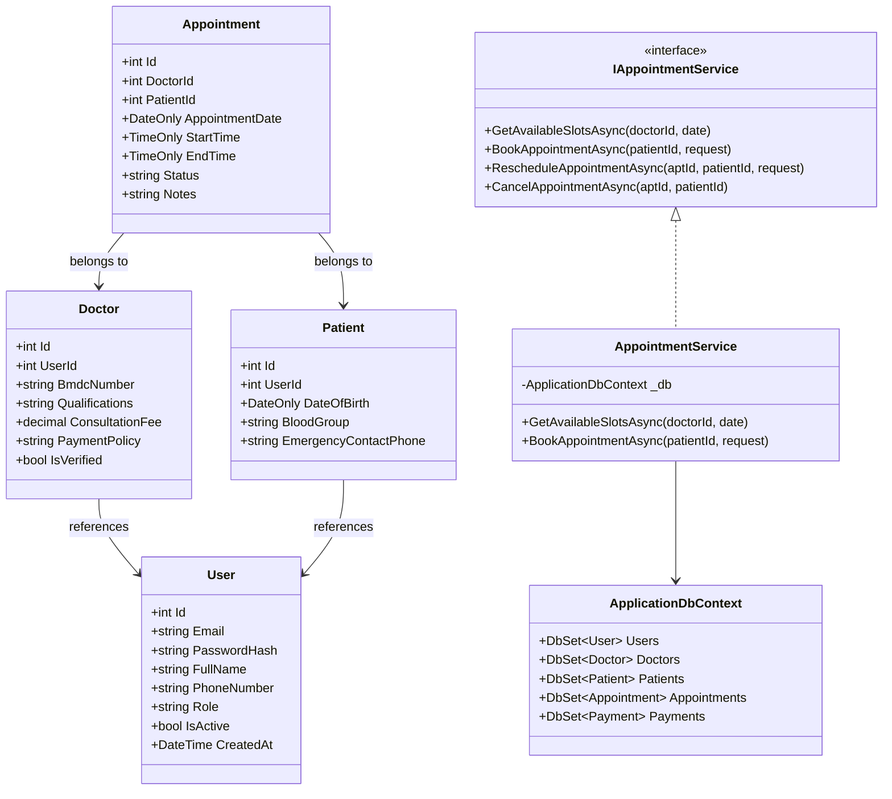

# UML Class Diagram (Domain Model & Services)

## Purpose
Models the core C# classes, entities, DTOs, and services in `server/Sunshine.App`.

## Diagram

```mermaid
classDiagram
    class User {
        +int Id
        +string Email
        +string PasswordHash
        +string FullName
        +string PhoneNumber
        +string Role
        +bool IsActive
        +DateTime CreatedAt
    }
    
    class Doctor {
        +int Id
        +int UserId
        +string BmdcNumber
        +string Qualifications
        +decimal ConsultationFee
        +string PaymentPolicy
        +bool IsVerified
    }
    
    class Patient {
        +int Id
        +int UserId
        +DateOnly DateOfBirth
        +string BloodGroup
        +string EmergencyContactPhone
    }
    
    class Appointment {
        +int Id
        +int DoctorId
        +int PatientId
        +DateOnly AppointmentDate
        +TimeOnly StartTime
        +TimeOnly EndTime
        +string Status
        +string Notes
    }
    
    class IAppointmentService {
        <<interface>>
        +GetAvailableSlotsAsync(doctorId, date)
        +BookAppointmentAsync(patientId, request)
        +RescheduleAppointmentAsync(aptId, patientId, request)
        +CancelAppointmentAsync(aptId, patientId)
    }
    
    class AppointmentService {
        -ApplicationDbContext _db
        +GetAvailableSlotsAsync(doctorId, date)
        +BookAppointmentAsync(patientId, request)
    }
    
    class ApplicationDbContext {
        +DbSet~User~ Users
        +DbSet~Doctor~ Doctors
        +DbSet~Patient~ Patients
        +DbSet~Appointment~ Appointments
        +DbSet~Payment~ Payments
    }
    
    IAppointmentService <|.. AppointmentService
    AppointmentService --> ApplicationDbContext
    Doctor --> User : references
    Patient --> User : references
    Appointment --> Doctor : belongs to
    Appointment --> Patient : belongs to
```
