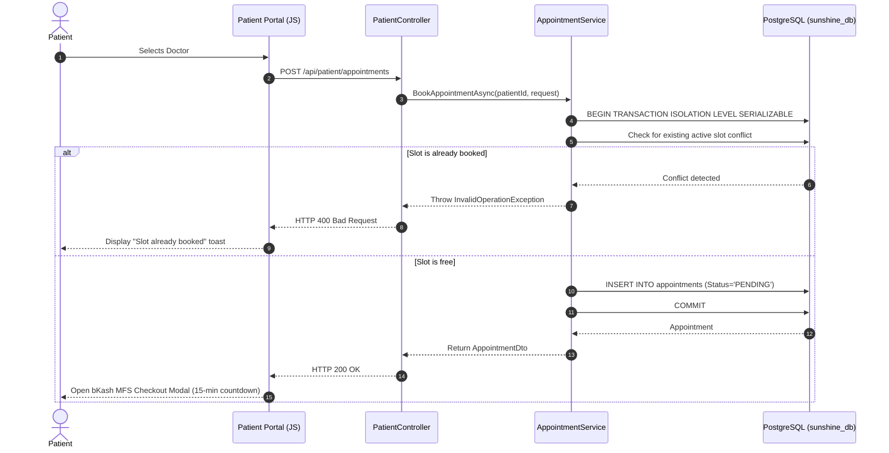
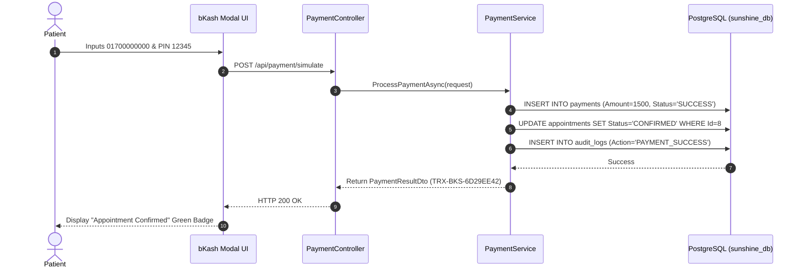

# Sequence Diagrams: Appointment Booking & Payment

## Purpose
Step-by-step sequence diagrams showing appointment booking and bKash sandbox payment.

## 1. Appointment Booking Sequence

## 2. bKash MFS Payment Sequence

