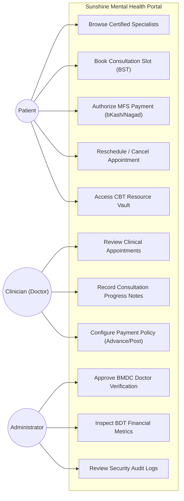

# UML Use Case Diagram

## Purpose
Illustrates the interactions between actors (Patient, Doctor, Admin) and the Sunshine platform.

## Diagram

```mermaid
flowchart LR
    Patient(("Patient"))
    Doctor(("Clinician (Doctor)"))
    Admin(("Administrator"))
    
    subgraph Portal ["Sunshine Mental Health Portal"]
        UC1["Browse Certified Specialists"]
        UC2["Book Consultation Slot (BST)"]
        UC3["Authorize MFS Payment (bKash/Nagad)"]
        UC4["Reschedule / Cancel Appointment"]
        UC5["Access CBT Resource Vault"]
        UC6["Review Clinical Appointments"]
        UC7["Record Consultation Progress Notes"]
        UC8["Configure Payment Policy (Advance/Post)"]
        UC9["Approve BMDC Doctor Verification"]
        UC10["Inspect BDT Financial Metrics"]
        UC11["Review Security Audit Logs"]
    end
    
    Patient --> UC1
    Patient --> UC2
    Patient --> UC3
    Patient --> UC4
    Patient --> UC5
    
    Doctor --> UC6
    Doctor --> UC7
    Doctor --> UC8
    
    Admin --> UC9
    Admin --> UC10
    Admin --> UC11
```
