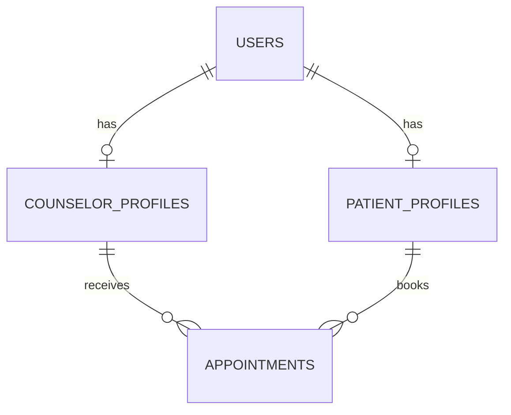

# Sunshine Mental Health Portal

## Complete Beginner-Friendly Project Documentation Generation Prompt

You are a senior software architect, technical writer, educator, and developer documentation engineer.

Your task is to create a **complete, professional, beginner-friendly documentation system** for the finished:

> **Sunshine Mental Health Portal**

The documentation must explain the entire project from **absolute beginning to advanced development and deployment**, so that a beginner developer can understand how the project works and can reproduce the project from scratch on an **Omarchy Linux system**.

---

# 1. MOST IMPORTANT RULE

Do NOT write generic documentation.

Before writing anything:

1. Inspect the entire repository.
2. Read the source code.
3. Read the database SQL files.
4. Read EF Core models/configuration.
5. Read migrations.
6. Read controllers.
7. Read services.
8. Read APIs.
9. Read frontend HTML/CSS/JavaScript.
10. Read authentication/authorization implementation.
11. Read configuration files.
12. Read environment configuration.
13. Read tests.
14. Read package/dependency files.
15. Read existing README/documentation.
16. Understand the actual architecture.

The documentation must describe **what the project actually does**, not what you assume it does.

If documentation and source code disagree:

> Treat the source code as the source of truth.

---

# 2. TARGET AUDIENCE

Write the documentation primarily for:

> A beginner developer who knows basic programming but is still learning software architecture, ASP.NET Core, Entity Framework Core, PostgreSQL, HTML, CSS, JavaScript, APIs, Git, testing, and Linux development.

Assume the developer may not know:

* ASP.NET architecture
* dependency injection
* Entity Framework Core
* migrations
* PostgreSQL administration
* REST APIs
* authentication
* authorization
* middleware
* environment variables
* database relationships
* transactions
* responsive UI development
* browser developer tools
* automated testing
* deployment

Explain these concepts before expecting the reader to use them.

---

# 3. OPERATING SYSTEM

The primary development environment is:

> **Omarchy Linux**

Omarchy is Arch Linux based.

Therefore, all setup instructions must be written primarily for:

```text
Omarchy / Arch Linux
```

Do NOT make Ubuntu the primary platform.

If a command differs between Arch/Omarchy and Ubuntu, document the Omarchy method first.

---

# 4. TECHNOLOGY STACK

The documentation must accurately explain this project's stack:

```text
Frontend
├── HTML5
├── CSS3
├── JavaScript
└── Material Design / Material UI principles

Backend
├── ASP.NET Core
├── C#
└── Entity Framework Core

Database
└── PostgreSQL

PostgreSQL Provider
└── Npgsql.EntityFrameworkCore.PostgreSQL
```

Testing tools should be documented based on what is actually installed in the repository.

Do not invent technologies.

If the project uses additional libraries, document them based on the actual project files.

---

# 5. CREATE A DOCUMENTATION DIRECTORY

Create:

```text
documentation/
```

The documentation should be organized into logical sections.

Recommended structure:

```text
documentation/
│
├── README.md
│
├── 01-getting-started/
│   ├── introduction.md
│   ├── prerequisites.md
│   ├── development-environment.md
│   ├── terminal-basics.md
│   └── project-setup.md
│
├── 02-project-overview/
│   ├── system-overview.md
│   ├── features.md
│   ├── architecture.md
│   ├── technology-stack.md
│   └── project-structure.md
│
├── 03-omarchy-setup/
│   ├── omarchy-overview.md
│   ├── package-management.md
│   ├── git-setup.md
│   ├── dotnet-setup.md
│   ├── postgresql-setup.md
│   ├── browser-setup.md
│   └── development-tools.md
│
├── 04-database/
│   ├── database-overview.md
│   ├── postgresql-installation.md
│   ├── database-creation.md
│   ├── users-and-permissions.md
│   ├── schema.md
│   ├── tables.md
│   ├── relationships.md
│   ├── indexes.md
│   ├── constraints.md
│   ├── seed-data.md
│   ├── sql-files.md
│   └── troubleshooting.md
│
├── 05-backend/
│   ├── aspnet-core-overview.md
│   ├── project-structure.md
│   ├── configuration.md
│   ├── dependency-injection.md
│   ├── middleware.md
│   ├── models.md
│   ├── controllers.md
│   ├── services.md
│   ├── api-design.md
│   ├── validation.md
│   ├── error-handling.md
│   └── logging.md
│
├── 06-entity-framework/
│   ├── ef-core-overview.md
│   ├── dbcontext.md
│   ├── entities.md
│   ├── relationships.md
│   ├── fluent-api.md
│   ├── migrations.md
│   ├── queries.md
│   ├── transactions.md
│   └── troubleshooting.md
│
├── 07-frontend/
│   ├── frontend-overview.md
│   ├── html.md
│   ├── css.md
│   ├── javascript.md
│   ├── material-design.md
│   ├── components.md
│   ├── pages.md
│   ├── forms.md
│   ├── api-integration.md
│   ├── responsive-design.md
│   └── accessibility.md
│
├── 08-authentication/
│   ├── authentication-overview.md
│   ├── registration.md
│   ├── login.md
│   ├── logout.md
│   ├── password-security.md
│   ├── authorization.md
│   ├── roles.md
│   └── protected-resources.md
│
├── 09-features/
│   ├── patient-system.md
│   ├── counselor-system.md
│   ├── counselor-discovery.md
│   ├── appointment-system.md
│   ├── scheduling-system.md
│   ├── notifications.md
│   ├── resources.md
│   └── admin-system.md
│
├── 10-api/
│   ├── api-overview.md
│   ├── endpoints.md
│   ├── authentication.md
│   ├── request-response.md
│   ├── status-codes.md
│   ├── error-responses.md
│   └── api-testing.md
│
├── 11-testing/
│   ├── testing-overview.md
│   ├── unit-testing.md
│   ├── integration-testing.md
│   ├── api-testing.md
│   ├── e2e-testing.md
│   ├── database-testing.md
│   ├── ui-testing.md
│   ├── mobile-testing.md
│   └── debugging.md
│
├── 12-security/
│   ├── security-overview.md
│   ├── authentication-security.md
│   ├── authorization-security.md
│   ├── database-security.md
│   ├── api-security.md
│   ├── input-validation.md
│   ├── secrets-management.md
│   └── privacy.md
│
├── 13-development-guide/
│   ├── development-workflow.md
│   ├── adding-a-feature.md
│   ├── adding-an-api.md
│   ├── adding-a-database-table.md
│   ├── modifying-existing-features.md
│   ├── debugging-workflow.md
│   └── coding-guidelines.md
│
├── 14-deployment/
│   ├── deployment-overview.md
│   ├── production-configuration.md
│   ├── database-production.md
│   ├── build.md
│   ├── deployment.md
│   ├── reverse-proxy.md
│   ├── https.md
│   └── post-deployment-checklist.md
│
├── 15-troubleshooting/
│   ├── common-errors.md
│   ├── postgresql-errors.md
│   ├── dotnet-errors.md
│   ├── ef-core-errors.md
│   ├── frontend-errors.md
│   ├── api-errors.md
│   ├── browser-errors.md
│   └── omarchy-errors.md
│
├── 16-reference/
│   ├── commands.md
│   ├── environment-variables.md
│   ├── database-reference.md
│   ├── api-reference.md
│   ├── glossary.md
│   └── faq.md
│
└── 17-learning-path/
    ├── beginner-roadmap.md
    ├── backend-learning.md
    ├── frontend-learning.md
    ├── database-learning.md
    └── recommended-next-steps.md
```

You may adjust this structure if the actual project requires it.

Do not create dozens of meaningless files.

Every documentation file must have useful content.

---

# 6. DOCUMENTATION README

Create:

```text
documentation/README.md
```

This should act as the documentation homepage.

Include:

* project name
* what the project does
* technology stack
* architecture overview
* beginner learning path
* setup guide
* database guide
* backend guide
* frontend guide
* testing guide
* deployment guide
* troubleshooting
* API reference

Create a clear navigation structure.

Example:

```text
Start Here
   ↓
Omarchy Setup
   ↓
Project Setup
   ↓
PostgreSQL
   ↓
ASP.NET Core
   ↓
EF Core
   ↓
Frontend
   ↓
Authentication
   ↓
Features
   ↓
Testing
   ↓
Deployment
```

---

# 7. ABSOLUTE BEGINNER SETUP

The documentation must explain how to start from a fresh Omarchy installation.

Explain:

## Step 1 — Update system

Explain:

```bash
sudo pacman -Syu
```

Explain what the command does.

---

# 8. INSTALLING DEVELOPMENT TOOLS

Document installation of all required tools.

For example:

```bash
sudo pacman -S git
```

.NET SDK installation must be based on the version actually required by the project.

Explain:

```bash
dotnet --version
```

and:

```bash
dotnet --info
```

Explain what these commands show.

Also document:

* PostgreSQL
* Git
* browser
* editor/IDE
* useful CLI utilities
* API testing tools if actually used
* testing tools

Do not tell the user to install unnecessary software.

---

# 9. OMARCHY-SPECIFIC GUIDANCE

Explain the differences between:

```text
pacman
yay
systemctl
journalctl
```

Explain when each should be used.

Explain service management.

For example:

```bash
sudo systemctl enable --now postgresql
```

Explain:

* `enable`
* `--now`
* service status

Show how to check:

```bash
systemctl status postgresql
```

Show how to inspect logs:

```bash
journalctl -u postgresql
```

---

# 10. TERMINAL BEGINNER GUIDE

Because the documentation is for a beginner, explain basic commands used throughout the project:

```bash
pwd
ls
cd
mkdir
cp
mv
rm
cat
less
nano
git
```

Explain what each command means.

Do not assume the reader knows Linux terminal syntax.

---

# 11. GIT SETUP

Explain from scratch:

```bash
git --version
git config --global user.name "Your Name"
git config --global user.email "you@example.com"
```

Explain:

* repository
* commit
* branch
* remote
* pull
* push
* clone
* `.gitignore`

Then explain how this specific project uses Git.

---

# 12. CLONING THE PROJECT

Provide exact commands based on the actual repository.

For example:

```bash
git clone <repository-url>
cd <project-directory>
```

Do NOT invent the repository URL.

If the URL is available in the repository documentation, use it.

Otherwise use a placeholder and clearly label it.

---

# 13. PROJECT STRUCTURE EXPLANATION

Create a detailed explanation of the actual repository structure.

Example:

```text
project/
├── frontend/
├── backend/
├── sql/
├── tests/
├── documentation/
└── README.md
```

But use the actual structure.

Explain every important directory.

For each:

```text
What is it?
Why does it exist?
What files are inside?
Who uses it?
When would a developer modify it?
```

---

# 14. DATABASE FROM SCRATCH

This section must be extremely detailed.

Explain PostgreSQL to a beginner.

Start with:

> What is PostgreSQL?

Then explain:

* server
* database
* schema
* table
* row
* column
* primary key
* foreign key
* index
* constraint
* transaction

Then explain how these concepts are used in Sunshine Mental Health Portal.

---

# 15. POSTGRESQL INSTALLATION ON OMARCHY

Provide exact installation commands appropriate for Omarchy.

Verify the installed PostgreSQL version.

Explain:

```bash
psql --version
```

Explain how to start PostgreSQL.

Explain how to verify the service.

---

# 16. CREATE DATABASE

Explain exactly how the Sunshine database is created.

Show:

```bash
sudo -u postgres psql
```

Then explain PostgreSQL commands.

Document the actual database name used by the project.

Do not invent one.

---

# 17. DATABASE USERS AND PERMISSIONS

Explain:

* PostgreSQL users
* roles
* passwords
* privileges
* ownership

Explain why the application should NOT normally connect as PostgreSQL superuser.

Show the project's recommended application database user.

Never expose real credentials.

---

# 18. RUNNING SQL FILES

Explain exactly how to execute:

```text
sql/01_*.sql
sql/02_*.sql
...
```

For example:

```bash
psql -U <user> -d <database> -f sql/03_schema.sql
```

Explain:

* `-U`
* `-d`
* `-f`

Explain what happens internally.

---

# 19. DATABASE SCHEMA DOCUMENTATION

Create a detailed database explanation.

For every table:

```text
Table name
Purpose
Columns
Data types
Primary key
Foreign keys
Constraints
Indexes
Relationships
Used by which feature
```

Example format:

```text
users
-----
Purpose:
Stores authentication/user information.

Columns:
id
email
password_hash
role
created_at
...
```

But use the actual schema.

---

# 20. DATABASE RELATIONSHIPS

Explain relationships visually where useful.

Use Mermaid diagrams where appropriate.

Example:



The diagram must reflect the actual database.

---

# 21. WHY EACH TABLE EXISTS

Do not merely document column names.

Explain the reasoning.

For example:

> Why do we have a separate `counselor_profiles` table instead of putting all counselor information into `users`?

Explain the architectural decision in beginner-friendly language.

---

# 22. SQL FILE EXPLANATION

Explain every SQL file in:

```text
sql/
```

For each file explain:

* purpose
* execution order
* important queries
* what tables it creates/modifies
* whether it is safe to rerun
* expected result

---

# 23. SEED DATA EXPLANATION

Explain:

* what seed data is
* why it exists
* how to run it
* what users are created
* what counselors are created
* what appointments are created
* how to reset development data

Clearly distinguish:

```text
development seed data
```

from:

```text
production data
```

---

# 24. ASP.NET CORE EXPLANATION

Teach ASP.NET Core from the project's actual implementation.

Explain:

* what ASP.NET Core is
* application startup
* Program.cs
* dependency injection
* middleware
* configuration
* controllers
* services
* models
* DTOs
* API endpoints

Use actual files and classes from the project.

---

# 25. EXPLAIN THE REQUEST LIFECYCLE

Explain what happens when the user performs an operation.

For example:

```text
User clicks "Book Appointment"
        ↓
JavaScript
        ↓
HTTP POST request
        ↓
ASP.NET Core
        ↓
Authentication
        ↓
Authorization
        ↓
Controller
        ↓
Service
        ↓
EF Core
        ↓
PostgreSQL
        ↓
Response
        ↓
JavaScript
        ↓
UI update
```

Explain every step.

---

# 26. ENTITY FRAMEWORK CORE

Teach EF Core using this actual project.

Explain:

* DbContext
* DbSet
* entity
* relationship
* tracking
* migrations
* LINQ
* queries
* SaveChanges
* transactions

Show actual examples from the repository.

---

# 27. EF CORE MIGRATIONS

Explain from scratch:

> What is a migration?

Then explain the project's commands.

For example:

```bash
dotnet ef migrations add InitialCreate
dotnet ef database update
```

But use the actual migration workflow used by the project.

Explain:

* creating migration
* reviewing migration
* applying migration
* rolling back
* production considerations

---

# 28. FRONTEND DOCUMENTATION

Explain the actual frontend.

Teach:

* HTML structure
* CSS architecture
* JavaScript
* DOM
* events
* fetch/API requests
* state management if applicable
* form handling
* validation
* responsive design

Use real project files as examples.

---

# 29. MATERIAL DESIGN SYSTEM

Explain how the project implements its white Material-style design.

Document:

* colors
* typography
* spacing
* buttons
* cards
* forms
* dialogs
* navigation
* tables
* status badges

Explain where these styles live in the actual project.

---

# 30. FEATURE-BY-FEATURE DOCUMENTATION

Document every major feature.

At minimum:

```text
Authentication
Patient system
Counselor system
Counselor discovery
Counselor profiles
Appointment booking
Scheduling
Notifications
Admin dashboard
User management
Counselor management
Appointment management
Resources
```

For each feature explain:

```text
What it does
User flow
Frontend files
Backend files
Database tables
API endpoints
Validation
Authorization
Testing
Common problems
```

---

# 31. APPOINTMENT SYSTEM — DETAILED

This is a core feature.

Explain the entire process:

```text
Counselor availability
        ↓
Available slots
        ↓
Patient selects slot
        ↓
Validation
        ↓
Conflict detection
        ↓
Transaction
        ↓
Appointment creation
        ↓
Notification
        ↓
Confirmation
```

Explain how double booking is prevented.

Explain the relevant database constraints and backend logic.

---

# 32. AUTHENTICATION DOCUMENTATION

Explain authentication from beginner level.

Cover:

* registration
* password hashing
* login
* sessions/tokens
* logout
* protected endpoints
* role-based authorization

Explain why passwords must never be stored as plaintext.

---

# 33. ROLE-BASED ACCESS CONTROL

Explain:

```text
PATIENT
COUNSELOR
ADMIN
```

using the actual implementation.

Create a permission table.

Explain how the backend determines whether the current user is allowed to perform an operation.

---

# 34. API DOCUMENTATION

Document every important endpoint.

Use a consistent format:

```text
POST /api/auth/login
```

### Purpose

What it does.

### Authentication

Required or not.

### Request

```json
{
  "email": "...",
  "password": "..."
}
```

### Response

```json
{
  ...
}
```

### Errors

List relevant errors.

### Database interaction

Explain which tables are affected.

Do this for all important APIs.

---

# 35. TESTING DOCUMENTATION

Teach testing from beginner level.

Explain:

> Why do we test software?

Then explain:

* unit tests
* integration tests
* API tests
* database tests
* E2E tests
* UI tests
* mobile tests

Explain the actual testing tools used by the repository.

---

# 36. HOW TO RUN TESTS

Provide exact commands.

For example:

```bash
dotnet test
```

and any frontend/browser test commands actually used.

Explain what the output means.

Explain:

* passed
* failed
* skipped
* test discovery
* test logs

---

# 37. MANUAL UI TESTING

Create a manual UI testing guide.

Explain how a beginner can test the website manually.

Include checklists for:

### Desktop

* Chrome
* Firefox
* Edge

### Mobile

* 320px
* 375px
* 390px
* 414px

Explain how to use browser DevTools responsive mode.

---

# 38. UI DEBUGGING

Teach how to use browser DevTools.

Explain:

```text
Elements
Console
Network
Application/Storage
Sources
Performance
```

Explain practical examples.

For example:

> The appointment button does nothing.

Then show how to investigate:

```text
Console
→ Network
→ Request
→ Response
→ Backend logs
→ Database
```

---

# 39. BACKEND DEBUGGING

Explain how to debug ASP.NET Core.

Show:

* console logs
* breakpoints if using an IDE
* exception stack traces
* HTTP status codes
* database errors
* EF Core errors

Explain how to inspect logs on Omarchy.

---

# 40. POSTGRESQL DEBUGGING

Teach basic PostgreSQL diagnostics.

Examples:

```bash
systemctl status postgresql
```

```bash
journalctl -u postgresql
```

and:

```bash
psql
```

Explain common issues:

* PostgreSQL isn't running
* authentication failed
* database doesn't exist
* permission denied
* port conflict
* connection refused
* migration failure

---

# 41. ENVIRONMENT VARIABLES

Document every environment variable actually used.

Create a table:

| Variable            | Purpose               | Example     | Required |
| ------------------- | --------------------- | ----------- | -------- |
| DATABASE_CONNECTION | PostgreSQL connection | `<example>` | Yes      |
| ...                 | ...                   | ...         | ...      |

Do not expose real secrets.

Use:

```text
.env.example
```

or the configuration mechanism actually used by ASP.NET Core.

Explain the difference between:

```text
development configuration
production configuration
secret values
```

---

# 42. SECURITY DOCUMENTATION

Explain the project's security architecture.

Cover:

* password hashing
* authentication
* authorization
* validation
* SQL injection protection
* XSS
* CSRF where relevant
* CORS
* rate limiting if implemented
* secrets
* database permissions
* logging
* audit logs
* sensitive information

Explain what protections come from ASP.NET Core/EF Core and what the application implements itself.

---

# 43. PRIVACY DOCUMENTATION

Because this is a mental-health counseling platform, explain privacy considerations.

Document:

* sensitive user data
* data minimization
* access control
* logging restrictions
* appointment privacy
* administrative access
* data storage

Do not claim legal compliance with a specific regulation unless the project has actually been reviewed for it.

---

# 44. DEPLOYMENT DOCUMENTATION

Explain how to build the application for production.

Start from:

```text
Development
    ↓
Testing
    ↓
Build
    ↓
Production configuration
    ↓
Database
    ↓
Deployment
    ↓
Verification
```

Document the actual deployment architecture.

If deployment infrastructure does not yet exist, explain a reasonable production architecture without pretending it is already implemented.

---

# 45. PRODUCTION DATABASE

Explain:

* production PostgreSQL
* database backups
* migrations
* database permissions
* connection strings
* security
* monitoring

Do not tell users to use a PostgreSQL superuser for the application.

---

# 46. BACKUPS

Create a beginner-friendly PostgreSQL backup guide.

Explain:

```bash
pg_dump
pg_restore
```

where appropriate.

Explain:

* full backup
* restore
* backup testing
* why backups matter

Do not assume backups work merely because `pg_dump` completed.

---

# 47. TROUBLESHOOTING

Create a large troubleshooting section.

Use:

```text
Problem
Cause
How to diagnose
Solution
Prevention
```

Examples:

### PostgreSQL

* service not running
* connection refused
* authentication failure
* database missing
* permission denied

### ASP.NET

* port already in use
* database connection failure
* migration error
* dependency injection error
* 500 error

### EF Core

* migration mismatch
* relationship error
* duplicate key
* foreign key violation

### Frontend

* API not responding
* CORS error
* JavaScript error
* 404
* broken navigation
* mobile layout problem

### Omarchy

* package installation problems
* systemd issues
* permissions
* firewall/network issues

---

# 48. "HOW TO ADD A NEW FEATURE"

This is especially important for a beginner.

Create a guide showing how to add a feature from scratch.

Example:

> Add a new "Counselor Certification" feature.

Explain the complete process:

```text
Requirement
↓
Database design
↓
SQL
↓
EF Core entity
↓
Migration
↓
Service
↓
Controller/API
↓
Frontend
↓
Validation
↓
Authorization
↓
Testing
↓
Documentation
```

Explain what changes need to happen in each layer.

---

# 49. "HOW TO ADD A NEW TABLE"

Create a step-by-step tutorial:

```text
Design table
↓
Write SQL
↓
Create EF Core entity
↓
Configure relationship
↓
Create migration
↓
Apply migration
↓
Create service
↓
Create API
↓
Create frontend
↓
Test
```

Use a small example.

---

# 50. "HOW TO ADD A NEW API ENDPOINT"

Explain:

```text
Requirement
↓
DTO
↓
Controller
↓
Service
↓
EF Core
↓
Validation
↓
Authorization
↓
Testing
```

Show actual project conventions.

---

# 51. "HOW TO MODIFY AN EXISTING FEATURE"

Explain how a beginner should safely modify the application.

Include:

1. Find the frontend entry point.
2. Find the API.
3. Find the service.
4. Find the database entities.
5. Understand existing tests.
6. Make a small change.
7. Run tests.
8. Test manually.
9. Check database behavior.
10. Commit changes.

---

# 52. DEVELOPMENT WORKFLOW

Create a practical daily workflow.

Example:

```text
Open terminal
↓
Check PostgreSQL
↓
Pull latest code
↓
Create branch
↓
Start backend
↓
Start frontend
↓
Make change
↓
Run tests
↓
Manual UI test
↓
Check mobile
↓
Review diff
↓
Commit
```

Explain each step.

---

# 53. BEGINNER LEARNING PATH

Create a learning roadmap based on this project.

Recommended sequence:

```text
1. Linux basics
2. Git
3. HTML
4. CSS
5. JavaScript
6. HTTP
7. REST API
8. C#
9. ASP.NET Core
10. PostgreSQL
11. SQL
12. Entity Framework Core
13. Authentication
14. Authorization
15. Testing
16. Deployment
```

For each stage explain:

* what to learn
* why it matters to this project
* where it appears in the project

---

# 54. GLOSSARY

Create:

```text
documentation/16-reference/glossary.md
```

Explain beginner terms such as:

```text
API
Backend
Frontend
Database
Schema
Table
Primary Key
Foreign Key
ORM
EF Core
DbContext
Migration
Middleware
Dependency Injection
DTO
HTTP
REST
JSON
JWT
Authentication
Authorization
RBAC
CRUD
Transaction
Index
Constraint
CORS
XSS
CSRF
E2E
Responsive Design
```

Keep definitions simple.

---

# 55. COMMAND REFERENCE

Create:

```text
documentation/16-reference/commands.md
```

Collect important commands used throughout the project.

Group them:

```text
Linux
Git
.NET
ASP.NET
EF Core
PostgreSQL
Testing
```

For every command explain what it does.

---

# 56. FAQ

Create a beginner FAQ.

Examples:

> Why can't my application connect to PostgreSQL?

> Why does `dotnet ef` not exist?

> Why is my migration failing?

> Why am I getting HTTP 401?

> Why am I getting HTTP 403?

> Why does the browser show CORS errors?

> Why does the mobile menu not open?

> Why does my appointment booking fail?

> Why is PostgreSQL not starting?

> How do I reset development data?

---

# 57. DOCUMENTATION STYLE

Use:

* clear headings
* short paragraphs
* numbered steps
* bullet lists
* tables
* code blocks
* diagrams
* examples
* warnings
* notes
* troubleshooting sections

Avoid:

* huge walls of text
* unnecessary academic language
* unexplained terminology
* generic filler
* fake examples presented as actual project behavior

---

# 58. COMMAND EXPLANATION RULE

Whenever giving a command to a beginner, explain it.

Instead of only:

```bash
sudo systemctl enable --now postgresql
```

write:

```bash
sudo systemctl enable --now postgresql
```

Then explain:

* `sudo` → runs the command with administrator privileges
* `systemctl` → manages Linux services
* `enable` → starts the service automatically at boot
* `--now` → starts it immediately
* `postgresql` → the PostgreSQL service

Apply this principle throughout the documentation.

---

# 59. CODE EXPLANATION RULE

When showing important code, explain:

1. What file it belongs to.
2. Where the file is located.
3. What the code does.
4. Why it exists.
5. How it connects to other parts of the system.

Do not dump large sections of code without explanation.

---

# 60. ARCHITECTURE DIAGRAMS

Use Mermaid diagrams where they improve understanding.

Include diagrams for:

### Overall architecture

```text
Browser
   ↓
Frontend
   ↓
ASP.NET Core API
   ↓
Services
   ↓
EF Core
   ↓
PostgreSQL
```

### Authentication

### Appointment booking

### Database relationships

### Request lifecycle

### Development workflow

Only use diagrams that accurately represent the implementation.

---

# 61. SOURCE-CODE REFERENCES

When explaining an implementation, always reference the actual file.

Example:

```text
backend/
└── Controllers/
    └── AppointmentController.cs
```

Then explain:

> This controller receives appointment-related HTTP requests.

Use actual paths from the repository.

Do not invent paths.

---

# 62. DOCUMENTATION ACCURACY AUDIT

After generating all documentation, perform another repository inspection.

Check every documentation claim against the source code.

Find:

* nonexistent files
* nonexistent commands
* outdated commands
* incorrect API endpoints
* incorrect database tables
* incorrect environment variables
* incorrect roles
* incorrect workflows

Correct everything.

---

# 63. DOCUMENTATION BUILD CHECK

Check all Markdown files for:

* broken links
* broken internal references
* incorrect code fences
* malformed Mermaid diagrams
* inconsistent headings
* spelling mistakes
* duplicate information
* contradictory instructions

---

# 64. DOCUMENTATION MAINTENANCE GUIDE

Create:

```text
documentation/README.md
```

section explaining how future developers should maintain the documentation.

Whenever a developer changes:

```text
Database
API
Authentication
Frontend
Feature
Deployment
Environment variables
Testing
```

they should update the relevant documentation.

---

# 65. DOCUMENTATION VERSIONING

Where useful, mention:

* project version
* .NET version
* PostgreSQL version
* EF Core version
* important dependency versions

These should be taken from the actual project.

Do not invent versions.

---

# 66. FINAL DOCUMENTATION QUALITY CHECK

Before finishing, verify:

### Beginner usability

* [ ] A beginner can install the required software.
* [ ] A beginner can configure Omarchy.
* [ ] A beginner can install PostgreSQL.
* [ ] A beginner can create the database.
* [ ] A beginner can run SQL scripts.
* [ ] A beginner can configure the connection.
* [ ] A beginner can run EF Core migrations.
* [ ] A beginner can start ASP.NET Core.
* [ ] A beginner can start the frontend.
* [ ] A beginner can log in.
* [ ] A beginner can test the application.
* [ ] A beginner can debug common errors.

### Technical coverage

* [ ] Architecture
* [ ] Database
* [ ] SQL
* [ ] EF Core
* [ ] ASP.NET Core
* [ ] APIs
* [ ] Authentication
* [ ] Authorization
* [ ] Frontend
* [ ] Responsive design
* [ ] Testing
* [ ] Security
* [ ] Deployment

### Accuracy

* [ ] All paths verified
* [ ] All commands verified
* [ ] All APIs verified
* [ ] Database schema verified
* [ ] Environment variables verified
* [ ] Roles verified
* [ ] Features verified
* [ ] Tests verified

---

# 67. FINAL DELIVERABLE

When finished, the repository should contain:

```text
documentation/
```

with a complete documentation system that allows a beginner to go from:

```text
Fresh Omarchy Installation
        ↓
Install Development Tools
        ↓
Install PostgreSQL
        ↓
Configure PostgreSQL
        ↓
Create Database
        ↓
Run SQL Scripts
        ↓
Configure Environment
        ↓
Configure EF Core
        ↓
Run Migrations
        ↓
Start ASP.NET Core
        ↓
Start Frontend
        ↓
Understand Architecture
        ↓
Understand Database
        ↓
Understand APIs
        ↓
Understand Authentication
        ↓
Understand Features
        ↓
Run Tests
        ↓
Debug Problems
        ↓
Modify Features
        ↓
Add New Features
        ↓
Deploy
```

---

# 68. FINAL INSTRUCTION

Do not generate documentation just to satisfy a checklist.

The goal is:

> **A beginner developer should be able to understand, install, run, debug, modify, test, and eventually extend the Sunshine Mental Health Portal by reading the documentation.**

Explain not only:

> **WHAT to do**

but also:

> **WHY we do it**

and:

> **HOW the pieces connect together.**

The documentation must teach the developer how the application works internally.

Use the actual finished repository as the source of truth.

**Inspect first. Document second. Verify third.**

Do not invent implementation details.

Do not document features that do not exist.

Do not claim commands were tested unless they were actually verified.

After generating the documentation, perform a final consistency audit against the complete source code and correct all discrepancies.
# 69. SYSTEM DIAGRAMS AND SOFTWARE MODELING

The documentation MUST include a complete set of professional system diagrams for the **Sunshine Mental Health Portal**.

These diagrams must be generated based on the **actual implemented system, database schema, APIs, classes, modules, and data flows**.

Do NOT create generic or theoretical diagrams that do not match the implementation.

Every diagram must be reviewed against the source code before being considered complete.

---

# 70. DIAGRAM DIRECTORY

Create a dedicated directory:

```text
documentation/
└── diagrams/
```

Organize diagrams and their explanations logically.

Recommended structure:

```text
documentation/
└── diagrams/
    ├── README.md
    │
    ├── architecture/
    │   ├── overall-architecture.md
    │   ├── backend-architecture.md
    │   ├── frontend-architecture.md
    │   └── deployment-architecture.md
    │
    ├── database/
    │   ├── er-diagram.md
    │   ├── database-overview.md
    │   └── relationships.md
    │
    ├── uml/
    │   ├── class-diagram.md
    │   ├── use-case-diagram.md
    │   └── sequence-diagrams.md
    │
    └── dfd/
        ├── dfd-level-0.md
        ├── dfd-level-1.md
        └── dfd-level-2.md
```

You may adjust this structure if the actual project requires it.

---

# 71. DIAGRAM TECHNOLOGY

Prefer **Mermaid** for diagrams that can be represented clearly with Mermaid.

This makes the diagrams:

* editable
* version-controlled
* text-based
* easy to maintain
* easy to render in GitHub/Markdown tools

Where Mermaid is insufficient for a specific diagram, use an appropriate alternative and document how it can be generated/viewed.

Do not create diagrams using screenshots when an editable diagram is possible.

---

# 72. ENTITY-RELATIONSHIP DIAGRAM — ER DIAGRAM

Create a complete **Entity-Relationship Diagram (ERD)** for the PostgreSQL database.

The ERD must reflect the actual database.

Include:

* all important tables
* primary keys
* foreign keys
* important attributes
* relationships
* cardinality

Example style:


However:

> Do NOT copy this example blindly.

Generate the ERD from the actual PostgreSQL schema.

---

# 73. ER DIAGRAM EXPLANATION

Do not provide only the diagram.

Explain the ERD in beginner-friendly language.

For each important relationship explain:

```text
Table A
    ↓
relationship
    ↓
Table B
```

Explain:

* one-to-one
* one-to-many
* many-to-many

where applicable.

Also explain why each relationship exists.

---

# 74. DATABASE RELATIONSHIP EXAMPLES

For example, if the actual system contains:

```text
Patient → Appointment
Counselor → Appointment
Counselor → Specialization
User → Notification
```

explain:

> A patient can have multiple appointments.

and:

> A counselor can have multiple appointments.

But only document relationships that actually exist.

---

# 75. UML CLASS DIAGRAM

Create a complete **UML Class Diagram** representing the important backend/domain classes.

The diagram should be based on the actual C# code.

Include relevant:

* entities
* DTOs where appropriate
* services
* controllers where useful
* interfaces
* important relationships
* inheritance
* dependencies

Do not put every trivial framework-generated class into the diagram.

Focus on the classes that help a developer understand the system.

---

# 76. CLASS DIAGRAM EXPLANATION

Explain the class diagram in beginner-friendly language.

For important classes explain:

```text
Class name
Purpose
Important properties
Important methods
Dependencies
Relationships
```

For example:

```text
AppointmentService
        ↓
AppointmentController
        ↓
Appointment entity
        ↓
AppDbContext
        ↓
PostgreSQL
```

Use the actual implementation.

---

# 77. OVERALL SYSTEM ARCHITECTURE DIAGRAM

Create a high-level architecture diagram showing the complete system.

At minimum represent:

```text
User
  ↓
Browser
  ↓
HTML / CSS / JavaScript
  ↓
ASP.NET Core API
  ↓
Controllers
  ↓
Services / Business Logic
  ↓
Entity Framework Core
  ↓
Npgsql
  ↓
PostgreSQL
```

If the project contains additional components, include them.

For example:

* authentication
* notification service
* file storage
* email service
* external APIs
* payment service
* logging
* caching

Only include components that actually exist.

---

# 78. ARCHITECTURE DIAGRAM — EXPLANATION

Explain the architecture from top to bottom.

For example:

### 1. Browser

The user interacts with the application through the browser.

### 2. Frontend

HTML, CSS, and JavaScript provide the user interface.

### 3. API

ASP.NET Core receives requests.

### 4. Business Logic

Services process application rules.

### 5. EF Core

EF Core translates application operations into database queries.

### 6. PostgreSQL

The database stores persistent information.

Explain the actual architecture in the project rather than blindly following this example.

---

# 79. DATA FLOW DIAGRAM — DFD LEVEL 0

Create a **Data Flow Diagram Level 0**, also known as a context-level diagram.

The system should be represented as one major process:

> Sunshine Mental Health Portal

Show external entities such as:

```text
Patient
Counselor
Administrator
```

and the major data flows between them and the system.

For example:

```text
Patient
   │
   │ Registration / Login / Appointment Request
   ↓
┌──────────────────────────────┐
│ Sunshine Mental Health Portal│
└──────────────────────────────┘
   ↑
   │ Appointment / Notification
   │
Patient
```

The actual diagram must reflect the implemented system.

---

# 80. DFD LEVEL 0 REQUIREMENTS

Level 0 should remain high-level.

Do NOT put:

* individual database tables
* controllers
* classes
* individual API endpoints

into the Level 0 DFD.

Focus on:

* external entities
* system
* major data flows

---

# 81. DFD LEVEL 1

Create a **DFD Level 1** decomposing the Sunshine Mental Health Portal into major processes.

Possible processes include:

```text
1.0 User Management
2.0 Counselor Management
3.0 Appointment Management
4.0 Scheduling
5.0 Notification Management
6.0 Resource Management
7.0 Administration
```

But use the actual system processes.

Include:

* external entities
* processes
* data stores
* data flows

Example data stores might include:

```text
D1 Users
D2 Counselors
D3 Appointments
D4 Availability
D5 Notifications
D6 Resources
```

Only include actual database stores.

---

# 82. DFD LEVEL 1 EXPLANATION

Explain every process.

For example:

### 3.0 Appointment Management

Receives:

```text
Patient → Appointment Request
```

Processes:

```text
Appointment validation
Availability verification
Conflict detection
Appointment creation
```

Produces:

```text
Appointment confirmation
```

and stores information in the appropriate database.

Again, use the actual implementation.

---

# 83. DFD LEVEL 2

Create **DFD Level 2** for the most important/complex process.

The primary candidate should be:

> Appointment Booking / Appointment Management

unless another process is demonstrably more complex in the actual project.

Break it down further.

Example:

```text
3.1 Select Counselor
        ↓
3.2 Check Availability
        ↓
3.3 Validate Appointment
        ↓
3.4 Check Booking Conflict
        ↓
3.5 Create Appointment
        ↓
3.6 Generate Notification
        ↓
3.7 Return Confirmation
```

Only include processes that actually exist.

---

# 84. DFD CONSISTENCY RULE

The DFD hierarchy must be logically consistent.

Ensure:

```text
DFD Level 0
      ↓
DFD Level 1
      ↓
DFD Level 2
```

The child processes must correctly decompose the parent process.

Do not introduce data flows in Level 2 that have no relationship to Level 1.

---

# 85. USE CASE DIAGRAM

Also create a UML **Use Case Diagram** if appropriate.

Actors should be based on the actual roles.

Potential actors:

```text
Patient
Counselor
Administrator
```

Potential use cases:

```text
Register
Login
Manage Profile
Browse Counselors
View Counselor
Book Appointment
Manage Appointment
Manage Availability
Manage Resources
Manage Users
Manage Counselors
Manage Appointments
View Analytics
```

Only include functionality that actually exists.

---

# 86. SEQUENCE DIAGRAMS

Create sequence diagrams for the most important workflows.

At minimum create:

### Appointment Booking Sequence

```text
Patient
  ↓
Frontend
  ↓
Appointment API
  ↓
Appointment Service
  ↓
EF Core
  ↓
PostgreSQL
  ↓
Appointment Service
  ↓
API
  ↓
Frontend
  ↓
Patient
```

Show actual validation and conflict detection where implemented.

---

# 87. AUTHENTICATION SEQUENCE DIAGRAM

Create a sequence diagram showing:

```text
User
 ↓
Login UI
 ↓
Authentication API
 ↓
Authentication Service
 ↓
Database
 ↓
Authentication Result
 ↓
Frontend
```

If tokens/cookies/session mechanisms are used, represent them accurately.

---

# 88. ADMIN WORKFLOW DIAGRAM

Create an appropriate diagram showing a major administrative workflow.

For example:

```text
Admin
 ↓
Admin Dashboard
 ↓
Counselor Management
 ↓
View Pending Counselor
 ↓
Review Information
 ↓
Approve / Reject
 ↓
Database
 ↓
Notification
```

Only document implemented behavior.

---

# 89. DIAGRAM DOCUMENTATION FORMAT

Every diagram file should follow this structure:

````markdown
# Diagram Name

## Purpose

Explain why this diagram exists.

## Diagram

```mermaid
...
````

## Explanation

Explain the diagram step by step.

## Related Source Code

* `path/to/file`
* `path/to/file`

## Related Database Tables

* `table_name`
* `table_name`

## Related API Endpoints

* `GET /api/...`
* `POST /api/...`

````

This connects the diagram directly to the implementation.

---

# 90. DIAGRAM README

Create:

```text
documentation/diagrams/README.md
````

Include a navigation table:

| Diagram                 | Purpose                                      |
| ----------------------- | -------------------------------------------- |
| Overall Architecture    | Shows the complete technical architecture    |
| ER Diagram              | Shows database structure and relationships   |
| Class Diagram           | Shows important C# classes and relationships |
| Use Case Diagram        | Shows system actors and functionality        |
| DFD Level 0             | Shows system context and major data flows    |
| DFD Level 1             | Shows major system processes                 |
| DFD Level 2             | Shows detailed appointment/data flow         |
| Appointment Sequence    | Shows booking request lifecycle              |
| Authentication Sequence | Shows login lifecycle                        |

---

# 91. DIAGRAM QUALITY REQUIREMENTS

All diagrams must be:

* readable
* logically correct
* consistent
* professionally structured
* based on actual implementation
* beginner-friendly

Avoid:

* huge unreadable diagrams
* unnecessary crossing lines
* meaningless entities
* duplicated relationships
* fictional components
* inconsistent naming

If a diagram becomes too large, split it into logical diagrams.

---

# 92. DIAGRAM NAMING CONSISTENCY

Use exactly the same names across:

```text
Database
C# entities
API documentation
Architecture diagrams
ER diagrams
Class diagrams
DFDs
Documentation
```

For example, if the actual database table is:

```text
appointments
```

do not call it:

```text
AppointmentData
```

in another diagram unless the distinction is intentional and explained.

---

# 93. DIAGRAM VALIDATION

After generating the diagrams, compare them against:

### Database

Verify the ERD against:

```text
sql/
EF Core entities
EF Core migrations
DbContext
```

### Class Diagram

Verify against:

```text
*.cs
```

### Architecture

Verify against:

```text
Program.cs
Controllers
Services
EF Core
Frontend
```

### DFD

Verify against:

```text
actual application workflows
API endpoints
database operations
```

### Sequence Diagrams

Verify against actual request/response flow.

Fix discrepancies.

---

# 94. BEGINNER EXPLANATION REQUIREMENT

Do not assume the reader understands diagrams.

Before the diagrams, explain:

> What is an ER diagram?

> What is a class diagram?

> What is a system architecture diagram?

> What is a DFD?

> What is DFD Level 0?

> What is DFD Level 1?

> What is DFD Level 2?

> What is a sequence diagram?

Explain the purpose of each and when developers use it.

---

# 95. COMPLETE SYSTEM MODELING PACKAGE

The final documentation must therefore contain at least:

```text
✓ Overall Architecture Diagram

✓ Frontend Architecture Diagram
✓ Backend Architecture Diagram

✓ Database ER Diagram

✓ UML Class Diagram

✓ UML Use Case Diagram

✓ Appointment Sequence Diagram
✓ Authentication Sequence Diagram

✓ DFD Level 0
✓ DFD Level 1
✓ DFD Level 2

✓ Deployment Architecture Diagram
```

If some of these are not applicable to the actual implementation, explain why rather than inventing components.

---

# 96. FINAL DIAGRAM GOAL

The diagrams should allow a beginner developer to visually understand:

```text
WHO
    ↓
uses
    ↓
WHAT
    ↓
through
    ↓
WHICH APPLICATION COMPONENT
    ↓
which communicates with
    ↓
WHICH DATABASE / SERVICE
    ↓
and how
    ↓
DATA FLOWS THROUGH THE SYSTEM
```

The final documentation should therefore provide both:

> **Written explanation**

and:

> **Visual explanation**

for the entire Sunshine Mental Health Portal.

The diagrams are not decorative.

They are part of the technical documentation and must accurately represent the real implementation.
